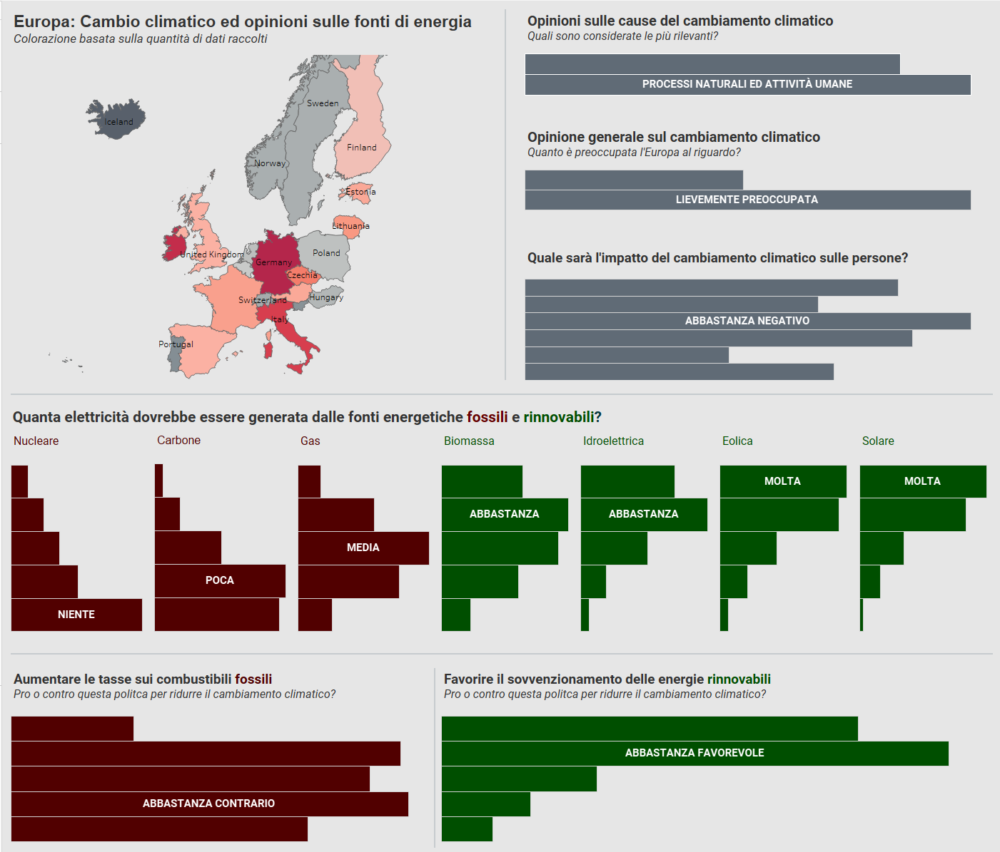

# European Climate Change Attitudes: Insights from the 2016/17 Social Survey

## Overview

Welcome to an in-depth exploration of European perspectives on climate change. This project delves into the European Social Survey (ESS) data from 2016/17, offering a comprehensive look at how citizens across 23 countries view one of the most pressing issues of our time.

## Project Structure

```
/European-Climate-Change-Attitudes
│
├── /data/
│   └── Climate Data Clean.xlsx     # Cleaned dataset for analysis
│
├── /visualizations/
│   └── Climate_Change_Dashboard.twbx # Interactive Tableau dashboard
│
├── /documentation/
│   └── ESS Documentation.pdf       # Comprehensive survey documentation
│
└── README.md                       # Project overview (You are here)
```

## Key Research Questions

Our analysis focused on four critical aspects of climate change perception:

1. What is the general consensus on climate change across Europe?
2. How concerned are Europeans about the potential impacts of climate change?
3. What are the preferences towards various energy sources (solar, wind, coal, etc.)?
4. How do these opinions vary between different European countries?

## Methodology

### Data Preparation
We meticulously cleaned and prepared the ESS Round 8 data, focusing on relevant variables from the Climate Change section. The process involved:
- Replacing missing value codes with NA for accurate analysis
- Filtering the dataset to focus on climate change and energy preference variables

### Visualization and Analysis
Utilizing Tableau, we created an interactive dashboard adhering to principles of Graphical Excellence. The visualization process involved:
- Developing dynamic filters for country-specific exploration
- Creating color-coded heatmaps for easy data interpretation
- Implementing clear labeling to enhance user understanding

## Key Findings

Our analysis revealed several notable insights:

1. **General Consensus**: A significant majority of Europeans acknowledge the reality of climate change, though concern levels vary.

2. **Varying Concerns**: Northern European countries like Sweden and Germany express higher levels of climate concern compared to Eastern European nations like Poland and Hungary.

3. **Energy Preferences**: Strong support for renewable energy sources, particularly wind and solar, is evident across Europe. However, reliance on traditional sources like coal shows regional variations.

4. **Regional Differences**: Southern European countries tend to focus more on energy pricing concerns, while Northern European nations prioritize environmental impact.

## Interactive Dashboard


Our Tableau dashboard offers an intuitive interface for exploring these climate attitudes. Users can filter by country, energy source, and concern level, providing a customizable research experience.

## Conclusion

This project sheds light on the complex tapestry of European attitudes towards climate change. By presenting these findings through an interactive medium, we aim to provide valuable insights for policymakers, researchers, and the general public alike.

## Files

- [`Climate_Change_Dashboard.twbx`](visualizations/Climate_Change_Dashboard.twbx): Tableau workbook with the interactive dashboard
- [`Climate Data Clean.xlsx`](data/Climate%20Data%20Clean.xlsx): Cleaned dataset used for analysis
- [`ESS Documentation.pdf`](documentation/ESS%20Documentation.pdf): Comprehensive ESS survey documentation

## How to Explore the Dashboard

1. Ensure you have Tableau Desktop installed on your system
2. Open the [`Climate_Change_Dashboard.twbx`](visualizations/Climate_Change_Dashboard.twbx) file
3. Use the interactive filters to explore specific countries or energy preferences

---

*For further information or inquiries about this project, please don't hesitate to reach out or open an issue in this repository.*
